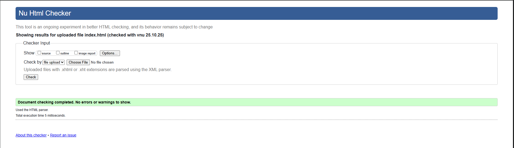
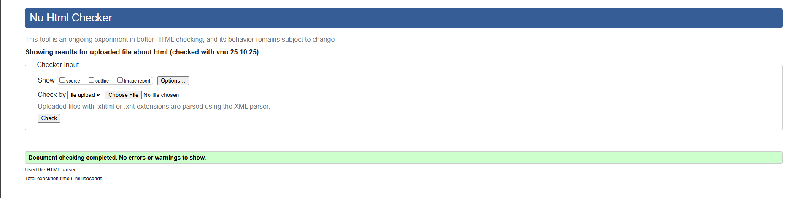

# NintendoManía

Somos NintendoManía, un grupo de  profesionales independientes unidos por la pasión y el rigor histórico. Nuestro objetivo es crear una revista digital especializada que documente el lore, la cronología de desarrollo y las curiosidades de las sagas principales de Nintendo: Super Mario Bros, Splatoon y Kirby.

La temática friki se aborda con una metodología de desarrollo profesional, garantizando que el producto final cumpla con los estándares más altos de accesibilidad y estructura web.

La Fase 1 se centra exclusivamente en construir un esqueleto HTML5 puro, semántico y accesible, sin utilizar ningún estilo CSS.

## Justificación de la temática

La elección de la temática de NintendoManía ha venido precedida por diversos factores. Principalmente hemos considerado que era la mejor forma de emplear nuestros conocimientos y hacer un proyecto sostenible a largo plazo cumpliendo con los criterios mientras pasábamos un buen rato estructurando y diseñando.

De la misma forma, hemos sopesado también que era muy buena elección puesto que esta estructura y temática nos permitía aplicar de forma exitosa y profesional las etiquetas semánticas exigidas.

A continuación vamos a abordar más rigurosamente la justificación de esta temática:

### Decisiones Clave y Rigor Técnico

La elección de la temática de NintendoManía fue estratégica ya que buscamos un proyecto sostenible que nos permitiera aplicar nuestros conocimientos técnicos al más alto nivel mientras abordábamos contenido de nuestro interés.

A lo largo del proyecto hemos empleado una estructura totalmente semántica, demostrando un dominio de HTML5 puro:

- Semántica Avanzada: Hemos estructurado la totalidad del sitio utilizando exclusivamente etiquetas semánticas `<section>, <article>, <figure>, <aside>`, demostrando el dominio de HTML5 puro.

- Uso Moderno: Hemos empleado etiquetas modernas como `
` y `
` en `contacto.html` y `index.html` para aportar dinamismo e interactividad al usuario sin recurrir a JavaScript aún.

- Atributos de Accesibilidad: Se hace uso de atributos `alt` descriptivos en todas las imágenes y la estructura semántica limpia garantiza una navegación fluida para las tecnologías asistivas.

- Formulario Robusto: El formulario de contacto.html incluye más de 6 tipos de inputs `(email, tel, url, select, radio, textarea)`, organizados lógicamente con `<fieldset>` y `<legend>`, cumpliendo el requisito de validación completa.

## Estructura de NintendoManía

El proyecto consta de las 6 páginas obligatorias más una opcional, cada una con una estructura única y justificada para cumplir el requisito de diferenciación:

| Archivo | Temática Principal | Estructura Diferencial Clave |
| :--- | :--- | :--- |
| **`index.html`** | Portada, Introducción y Acceso Rápido. | Estructura de **Índice Modular:** Usa `<aside>` y `
` para navegación junto con uso de etiquetas semánticas |
| **`sagas/mario.html`** | Cronología, análisis de sagas dentro de Mario y personajes. | Estructura **Jerárquica de Hitos (2D vs 3D):** Artículos clasificados por salto de dimensión. Uso exhaustivo de `<figure>` y `<figcaption>` así como empleo de `<blockquote>` y `<cite>` para citar.  |
| **`sagas/splatoon.html`** | Cronología, explicación del lore y armas| Estructura **Lineal y Modular:** Cronología vertical complementada con secciones de **Armas** e **Idols**. |
| **`sagas/kirby.html`** | Cronología , habilidades y jefes. | Estructura de **Fichas de Lore:** Uso intensivo de `<figure>` y `<figcaption>` para habilidades, jefes y curiosidades. |
| **`comparativas.html`**| Representación de datos de las sagas| Estructura **Tabular Rigurosa:** Múltiples `<table>` semánticas con `scope` para cumplir el requisito de datos. |
| **`contacto.html`** | Formulario y FAQ. | Estructura de **Formulario Avanzado:** Uso de `<fieldset>` para organización y `
/
` para el FAQ interactivo. |
| **`about.html`** | Origen, pilares y equipo | Uso de **etiquetas semánticas** y **listas** desordenadas `<ul>` y ordenadas `<ol>` |

## Decisiones de diseño estructural tomadas

### Cabecera `<header>` (Sin cambios relevantes entre páginas.)

Contiene dos elementos clave:

- El logotipo enlazado a la página principal.

- Dos bloques de navegación nav: el menú principal con enlaces a las sagas y secciones del sitio, y un segundo menú que aloja el formulario de búsqueda.

- En cada una de las sagas además incluye otra barra de navegación entre secciones de la misma.

Según las buenas prácticas de HTML5, el header debe englobar los encabezados introductorios y los elementos de navegación principales, de modo que los usuarios y los motores de búsqueda identifiquen esta área como el bloque superior común del sitio.

### Pie de página `<footer>`
Agrupa información de contacto (address), enlaces legales y atribuciones del proyecto dentro de dos secciones section.

El footer contiene información común y recurrente en todas las páginas y su uso refuerza la coherencia estructural del sitio.

### - `index.html`

#### Estructura general

Esta página sigue la estructura semántica estándar de HTML5, basada en las etiquetas principales `<header>, <main>, <aside> y <footer>`, delimitando secciones con significado específico para mejorar la accesibilidad, legibilidad y SEO.

##### Contenido principal `<main>`
Se divide en varias secciones `<section>` que diferencian los distintos propósitos del contenido:

- Primera sección: presenta la bienvenida e imagen principal, actuando como sección introductoria.

- Segunda sección: destaca las sagas disponibles con imágenes identificativas.

- Tercera sección: agrupa artículos `<article>` sobre cada saga (Mario, Splatoon, Kirby).
Cada article contiene su propio subtítulo h3, una figura `<figure>` con imagen y un párrafo descriptivo, siguiendo la recomendación semántica de que cada artículo debe poder comprenderse de forma independiente.

- Cuarta sección: alberga un formulario de suscripción con validación mediante atributos `required` y un campo `email`.

El contenido está distribuido jerárquicamente por secciones temáticas que agrupan información coherente entre sí, reforzando la mantenibilidad y la comprensión del código.

##### Barras laterales `<aside>`
Incluye dos bloques:

- El primero muestra noticias destacadas con `<article>` y `<figure>` dentro, permitiendo separar el contenido complementario.

- El segundo lista los puntos destacados por saga dentro de `
` y `
` para mejorar la accesibilidad y usabilidad.

El uso del elemento `<aside>` facilita destacar información relacionada pero no central, lo que mejora la jerarquía visual y semántica del documento.

Buenas prácticas aplicadas en esta página:

- **Indentación**: todo el código está correctamente indentado para máxima legibilidad.

- **Comentarios**: cada bloque estructural está comentado para facilitar mantenimiento.

- **Semántica**: solo se usan etiquetas con propósito semántico, evitando div innecesarios.

- **Validación**: el documento es conforme al W3C Markup Validator sin errores.

- Accesibilidad: todos los elementos multimedia incluyen atributos `alt`, los formularios poseen `<label>`, y se aplican patrones de marcado claros para lectores de pantalla.

### - `about.html`

#### Estructura general

La página **sigue la estructura semántica de HTML5**, con las etiquetas `header`, `nav`, `section`, `article`, `aside` y `footer`.
Cada una cumple una función específica dentro de la jerarquía del documento, garantizando una arquitectura limpia, comprensible, accesible y conforme a los estándares del W3C.

###### Secciones principales `<section>`

El contenido principal está dividido en cuatro bloques temáticos mediante `<section>`:

1. **Sobre nosotros:**
Expone la historia y misión con subtítulos y párrafos organizados en artículos (`<article>`). Incluye imágenes con atributos `alt` descriptivos.
2. **Pilares:**
Usa una lista no ordenada (`<ul>`) con subtítulos y descripciones para explicar los principios del proyecto, facilitando lectura estructurada y accesible.
3. **Equipo:**
Se compone de tres artículos (`<article>`) independientes con encabezados, figuras e información personal.
Cada bloque es autocontenible, permitiendo que el contenido pueda reutilizarse o presentarse fuera del contexto principal.
4. **Trayectoria:**
Presenta los hitos del proyecto mediante una lista ordenada (`<ol>`), lo que transmite una secuencia cronológica clara y lógica.

El uso de `<section>` y `<article>` permite organizar cada parte del contenido de manera semántica y coherente, siguiendo una jerarquía clara y comprendida tanto por el usuario como por los motores de búsqueda, mejorando el SEO.

##### Barra lateral `<aside>`

Incluye una llamada para los fans que quieran contribuir con el proyecto con imagen, pie de figura y un enlace para unirse al proyecto.
Sirve como elemento complementario al contenido principal, destacando información que mejora la experiencia pero sin interrumpir la narrativa característica de NintendoManía.

`<aside>` se usa adecuadamente para contenido tangencial o secundario en relación con el tema principal de la página. Mejora la accesibilidad y refuerza el diseño informativo.

Buenas prácticas aplicadas

- **Indentación correcta:** se mantiene el formato consistente y jerárquico del HTML.
- **Semántica pura:** solo se emplean etiquetas con propósito específico, evitando `div` sin contexto.
- **Accesibilidad:** todas las imágenes poseen un `alt` descriptivo y los formularios están correctamente etiquetados con `label`.
- **Jerarquía visual:** uso coherente de `h1` a `h3` según nivel de contenido.
- **Validación:** el documento es conforme al W3C Markup Validator sin errores.

- **Comentarios útiles:** cada bloque estructural está comentado (por ejemplo, `<!-- Sección equipo -->`) para favorecer mantenimiento y escalabilidad a largo plazo.