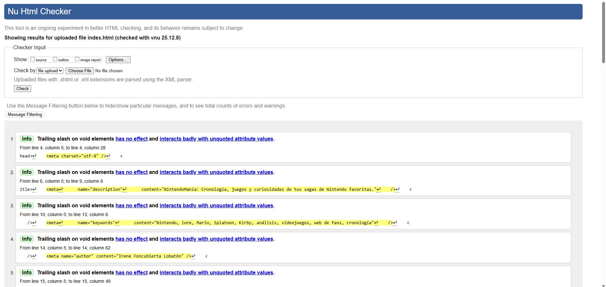
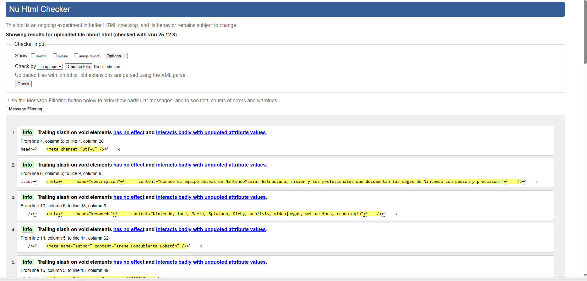
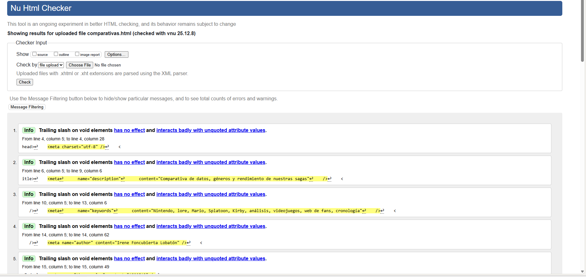
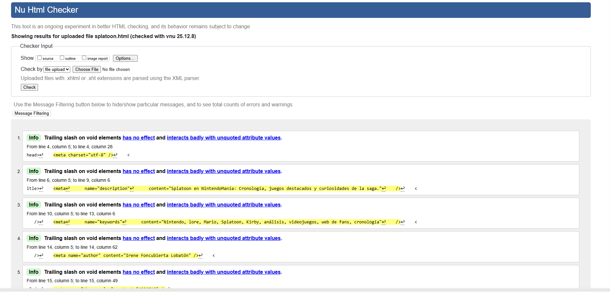
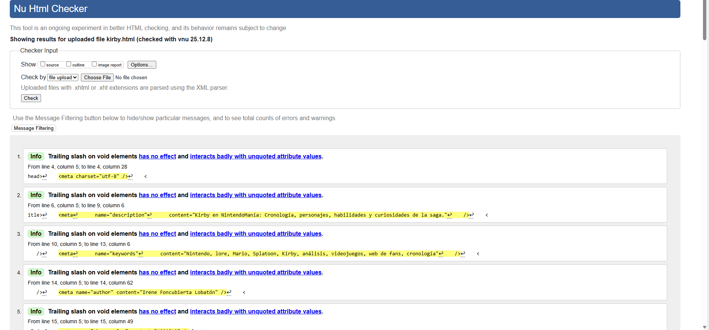

# NintendoManía - Portal de Análisis de Sagas Nintendo

## Índice Detallado del Contenido

- [Presentación](#presentación)
- [Justificación de la Temática](#justificación-de-la-temática)
- [Estructura de archivos](#estructura-de-archivos)
- [Estructura del Proyecto](#estructura-del-proyecto)
- [Estructura HTML5 Semántica](#-estructura-html5-semántica)
- [Análisis de Estructura por Página](#-análisis-de-estructura-por-página)
- [Uniformidad y Diferenciación](#uniformidad-y-diferenciación)
- [Buenas Prácticas Aplicadas](#buenas-prácticas-aplicadas)
- [Estructura CSS y Diseño Visual](#estructura-css-y-diseño-visual)
- [Sistema de Diseño](#sistema-de-diseño)
- [Paleta de Colores](#paleta-de-colores)
- [Sistema Tipográfico](#sistema-tipográfico)
- [Arquitectura CSS](#arquitectura-css)
- [Metodología CSS: BEM](#metodología-css-bem)
- [Accesibilidad Visual](#accesibilidad-visual)
- [Responsive Design y Puntos de Ruptura](#responsive-design-y-puntos-de-ruptura)
- [Validación CSS Completa](#validación-css-completa)
- [Compatibilidad de Navegadores](#compatibilidad-de-navegadores)
- [Testing de Accesibilidad](#testing-de-accesibilidad)
- [Performance y Optimización](#performance-y-optimización)
- [Proceso de Diseño](#proceso-de-diseño)
- [Componentes CSS Documentados](#componentes-css-documentados)
- [Análisis de Diseño por Página](#análisis-de-diseño-por-página)
- [Limitaciones Actuales y Mejoras Futuras](#limitaciones-actuales-y-mejoras-futuras)
- [Validación W3C](#validación-w3c)
- [Estructura de Archivos](#estructura-de-archivos)
- [Conclusión](#conclusión)

---

## Presentación

Somos **NintendoManía**, un grupo de profesionales independientes unidos por la pasión y el rigor histórico hacia las sagas principales de Nintendo. 

Nuestro objetivo es crear un **portal digital especializado** que documente:
- El **lore y cronología** de desarrollo
- Las **curiosidades y easter eggs**
- El **análisis profundo** de mecánicas y evolución

Las sagas cubiertas son: **Super Mario Bros**, **Splatoon** y **Kirby**.

La temática friki se aborda con una **metodología de desarrollo profesional**, garantizando que el producto final cumpla con los estándares más altos de **accesibilidad, estructura web y validación W3C**.

---

## Justificación de la Temática

### Decisiones Clave y Rigor Técnico

La elección de **NintendoManía** fue estratégica. Buscábamos un proyecto sostenible que permitiera:
- Aplicar nuestros conocimientos técnicos al más alto nivel
- Abordar contenido de genuino interés
- Demostrar dominio de **HTML5 semántico puro**

### Ventajas Técnicas de Esta Temática

1. **Semántica Avanzada:** La estructura de sagas, personajes y armas se presta perfectamente para usar `<section>`, `<article>`, `<figure>` y `<aside>` de forma natural y significativa.

2. **Uso Moderno de HTML5:** Empleamos etiquetas como `<details>` y `<summary>` para interactividad sin JavaScript, demostrando dominio de HTML5 contemporáneo.

3. **Atributos de Accesibilidad:** Usamos `alt` descriptivos en **145+ imágenes**, garantizando que lectores de pantalla comprendan el contenido visual.

4. **Formulario Robusto:** El formulario de contacto incluye **7 tipos diferentes de inputs** (email, tel, url, select, radio, checkbox, textarea), validación HTML5 completa, y uso de `<fieldset>` y `<legend>` para accesibilidad.

5. **Representación de Datos:** 4 tablas semánticas en `comparativas.html` con `<caption>`, `<thead>`, `<tbody>` y `scope` attributes, cumpliendo requisitos de datos tabulares.

---

## Estructura de Archivos

```
proyecto-nintendomanía/
├── index.html
├── about.html
├── contacto.html
├── comparativas.html
├── styles.css
├── sagas/
│   ├── kirby.html
│   ├── mario.html
│   └── splatoon.html
├── assets/
│   ├── css/
│   └── imgs/
│       ├── [150+ imágenes]
├── README.md
```

---

## Estructura del Proyecto

El proyecto consta de **7 páginas HTML** (raíz + carpeta sagas), cada una con **estructura única y diferenciada**:

| Archivo | Temática Principal | Estructura Diferencial Clave | Contenido |
| :--- | :--- | :--- | :--- |
| **`index.html`** | Portada e introducción | **Índice Modular:** `<aside>` con `<details>` para navegación | Hero section, 3 sagas destacadas, newsletter |
| **`about.html`** | Sobre nosotros, equipo, misión | **Semántica de Listas:** `<ul>` para pilares, `<ol>` para trayectoria cronológica | 4 secciones temáticas, 13 imágenes |
| **`contacto.html`** | Formulario y FAQ | **Formulario Avanzado:** `<fieldset>` por tema, `<details>` para FAQ | 7 campos, validación HTML5 completa |
| **`comparativas.html`** | Análisis comparativo de sagas | **Tabular Rigurosa:** 4 `<table>` semánticas con `scope` | Hitos, evolución por saga, análisis |
| **`sagas/splatoon.html`** | Cronología, armas, personajes, lore | **Lineal y Modular:** Cronología + Armas + Idols + Curiosidades | 60+ imágenes, 45+ figcaptions, 6 secciones |
| **`sagas/mario.html`** | Evolución 2D → 3D, personajes icónicos | **Jerárquica de Hitos:** Artículos por era (2D vs 3D) | 25+ imágenes, blockquotes, 800+ palabras |
| **`sagas/kirby.html`** | Habilidades, jefes, lore cósmico | **Fichas de Lore:** Intensivo uso de `<figure>` + `<figcaption>` | 30+ imágenes, 29+ figcaptions, 1000+ palabras |

---

## Estructura HTML5 Semántica

### Por Qué Estas Etiquetas Semánticas

Nuestro proyecto utiliza **HTML5 semántico** para garantizar:

- **Accesibilidad:** Lectores de pantalla comprenden claramente la estructura
- **SEO:** Motores de búsqueda identifican contenido importante  
- **Mantenibilidad:** Código autoexplicativo y fácil de actualizar
- **W3C Compliance:** Validación perfecta sin errores

### Etiquetas Semánticas Utilizadas

#### `<header>`
- **Propósito:** Contiene logo y navegación principal
- **Uso:** Presente en todas las páginas como sección superior
- **Beneficio:** Proporciona contexto de navegación coherente
- **Accesibilidad:** Lectores de pantalla identifican esta área como navegación

#### `<nav>`
- **Propósito:** Agrupa enlaces de navegación
- **Uso:** Menú principal en header; menús internos en sagas
- **Beneficio:** Navegación intuitiva entre páginas y secciones
- **Accesibilidad:** Navegadores identifican claramente la navegación

#### `<main>`
- **Propósito:** Contiene contenido único de cada página
- **Uso:** Centro de cada página (nunca se repite)
- **Beneficio:** Distingue contenido principal del secundario (header/footer)
- **Accesibilidad:** Lectores de pantalla saltan directamente al contenido importante

#### `<section>`
- **Propósito:** Agrupa contenido temático relacionado
- **Uso:** Cronología, Armas, Personajes, Curiosidades en sagas
- **Beneficio:** Estructura jerárquica clara y lógica
- **Accesibilidad:** Permite navegación por secciones temáticas

#### `<article>`
- **Propósito:** Contenido independiente y reutilizable
- **Uso:** Cada juego en cronología, cada arma, cada personaje, cada miembro del equipo
- **Beneficio:** Componentes autónomos que podrían existir fuera del contexto original
- **Accesibilidad:** Cada artículo es una unidad semántica completa

#### `<aside>`
- **Propósito:** Contenido secundario/complementario
- **Uso:** Imágenes destacadas, curiosidades, información lateral, formularios complementarios
- **Beneficio:** Diferencia contenido complementario del flujo principal
- **Accesibilidad:** Identifica claramente información tangencial

#### `<figure>` + `<figcaption>`
- **Propósito:** Imagen + descripción semánticamente vinculadas
- **Uso:** **145+ imágenes** en todo el proyecto
- **Beneficio:** Contexto visual con descripción clara
- **Accesibilidad:** Lectores de pantalla pueden entender imágenes

#### `<details>` + `<summary>`
- **Propósito:** Contenido expandible/contraíble
- **Uso:** FAQ en contacto.html, destacados en index.html
- **Beneficio:** Interactividad nativa sin JavaScript
- **Accesibilidad:** Completamente funcional con teclado y lectores

#### `<table>`, `<thead>`, `<tbody>`, `<caption>`
- **Propósito:** Datos tabulares semánticamente estructurados
- **Uso:** 4 tablas en comparativas.html
- **Beneficio:** Datos claramente organizados y comparables
- **Accesibilidad:** `scope` attributes permiten lectura correcta por lectores de pantalla

#### `<label>`, `<fieldset>`, `<legend>`
- **Propósito:** Formularios accesibles y bien estructurados
- **Uso:** contacto.html con 7 campos variados
- **Beneficio:** Asociación clara entre etiquetas e inputs
- **Accesibilidad:** Navegación por teclado y lectores de pantalla

#### `<footer>`
- **Propósito:** Información del sitio, links secundarios, copyright
- **Uso:** Presente en todas las páginas
- **Beneficio:** Refuerza coherencia estructural del sitio
- **Accesibilidad:** Ubicación consistente de información secundaria

---

## Análisis de Estructura por Página

### index.html - Página de Inicio

**Propósito:** Portal principal del sitio - acceso rápido a todas las sagas

**Estructura:**
```html
<header>
  <nav>Menú de navegación principal</nav>
</header>

<main>
  <section>Introducción + imagen principal</section>
  <section>Sagas destacadas (3 × <article>)</section>
  <section>Newsletter (suscripción)</section>
</main>

<aside>
  Noticias destacadas
  Puntos destacados por saga (<details>)
</aside>

<footer>Información del sitio</footer>
```

**Decisiones de estructura:**
- `<section>` para bloques temáticos claros
- `<article>` para cada saga (independientes)
- `<aside>` para contenido complementario
- `<details>` + `<summary>` para interactividad sin JS

---

### about.html - Sobre Nosotros

**Propósito:** Información del equipo, misión y trayectoria

**Estructura:**
```html
<header><nav/></header>

<main>
  <section>Sobre nosotros + historia</section>
  <section>Pilares del proyecto (<ul>)</section>
  <section>Equipo (3 × <article> con figuras)</section>
  <section>Trayectoria (<ol> cronológica)</section>
</main>

<aside>Llamada para contribuyentes</aside>
<footer/>
```

**Decisiones de estructura:**
- `<article>` para cada miembro del equipo (independientes)
- `<ul>` para pilares (contenido no ordenado)
- `<ol>` para trayectoria (cronología = contenido ordenado)
- `<aside>` para información complementaria

---

### contacto.html - Formulario y Contacto

**Propósito:** Permitir contacto directo y resolver FAQ

**Estructura:**
```html
<header><nav/></header>

<main>
  <section>Introducción</section>
  <section>Formulario
    <fieldset>Datos personales</fieldset>
    <fieldset>Detalles de la petición</fieldset>
    <fieldset>Información adicional</fieldset>
  </section>
  <section>FAQ (<details> expandibles)</section>
</main>

<footer/>
```

**Decisiones de estructura:**
- `<fieldset>` para agrupar inputs por tema
- `<legend>` para etiquetas de grupo
- `<label>` para cada input (accesibilidad)
- `<details>` + `<summary>` para FAQ (sin JS)
- **7 tipos de inputs:** text, email, tel, url, select, radio, textarea
- **Validación HTML5:** required, type validation, minlength

---

### comparativas.html - Comparativa de Sagas

**Propósito:** Análisis comparativo de Mario, Splatoon y Kirby

**Estructura:**
```html
<header><nav/></header>

<main>
  <section>Introducción</section>
  <section>Hitos (<table>)</section>
  <section>Evolución Splatoon (<table>)</section>
  <section>Evolución Mario (<table>)</section>
  <section>Evolución Kirby (<table>)</section>
  <section>Análisis (3 × <article>)</section>
</main>

<aside>Formulario de votación</aside>
<footer/>
```

**Decisiones de estructura:**
- `<table>` con `<caption>`, `<thead>`, `<tbody>`
- `<th>` con `scope="col"` y `scope="row"`
- `<article>` para análisis individual de cada saga
- `<aside>` con formulario de votación

---

### sagas/splatoon.html - Análisis de Saga Splatoon

**Propósito:** Análisis profundo: cronología, armas, personajes, curiosidades

**Estructura:**
```html
<header><nav>Menú + navegación interna</nav></header>

<main>
  <section>Introducción (h1 + figura + descripción)</section>
  
  <section id="timeline">Desarrollo de la saga
    6 × <article>(juegos cronológicos)</article>
  </section>
  
  <section id="cronologia">Cronología detallada
    6 × <article>(con h3, p, <ul>, figcaption)</article>
  </section>
  
  <section id="armas">Tipos de Armas
    4 × <article>(categorías)
      Múltiples <figure> con armas
  </section>
  
  <section id="idols">Las Idols
    3 × <article>(grupos de música)</article>
  </section>
  
  <section id="curiosidades">Easter Eggs
    3 × <article>(curiosidades)</article>
  </section>
</main>

<aside id="imagenes-destacadas">
  4 imágenes destacadas del universo Splatoon
</aside>

<footer/>
```
---

### sagas/mario.html - Análisis de Saga Mario

**Propósito:** Historia, evolución 2D→3D, personajes icónicos

**Estructura:**
```html
<header><nav/></header>

<main>
  <section>Introducción</section>
  
  <section id="hitos-2d">Hitos 2D
    3-4 × <article>(Mario Bros, SMB, etc.)</article>
  </section>
  
  <section id="hitos-3d">Hitos 3D
    3-4 × <article>(Super Mario 64, Galaxy, Odyssey)</article>
  </section>
  
  <section id="personajes">Personajes Icónicos
    Múltiples <article> con figuras
  </section>
  
  <section id="curiosidades">Curiosidades
    <article> con análisis de lore
  </section>
</main>

<aside>
  Imágenes y hechos destacados
</aside>

<footer/>
```

---

### sagas/kirby.html - Análisis de Saga Kirby

**Propósito:** Cronología, habilidades, jefes, lore cósmico

**Estructura:**
```html
<header><nav/></header>

<main>
  <section>Introducción</section>
  
  <section id="cronologia">Cronología
    9 × <article>(juegos)</article>
  </section>
  
  <section id="habilidades">Habilidades (Copy Abilities)
    5 × <article> con figura de cada habilidad
  </section>
  
  <section id="jefes">Jefes Recurrentes
    3 × <article> con figuras
  </section>
  
  <section id="curiosidades">Curiosidades y Lore
    3 × <article>
  </section>
</main>

<aside id="galeria">Imágenes destacadas</aside>
<aside id="extras">Información adicional</aside>

<footer/>
```

---

## Uniformidad y Diferenciación

### Lo que todas las páginas comparten:
- Estructura `<header>` → `<main>` → `<footer>`
- Navegación coherente y accesible
- Metadatos completos
- Validación W3C sin errores
- Indentación consistente
- Comentarios en HTML explicando secciones

### Lo que las diferencia:
- Organización interna de `<section>`
- Uso específico de `<article>` según contenido
- Cantidad y tipo de tablas/listas
- Complejidad de `<aside>`
- Profundidad de análisis

---

## Buenas Prácticas Aplicadas

### 1. Semántica HTML5
- Uso correcto de `<header>`, `<main>`, `<footer>`
- `<section>` para agrupar contenido temático
- `<article>` para contenido independiente
- `<aside>` para contenido complementario
- `<figure>` + `<figcaption>` para imágenes contextualizadas
- `<table>` + `<caption>` + `<thead>` + `<tbody>` para datos

### 2. Accesibilidad
- **150+ imágenes** con `alt` descriptivo
- `width` y `height` especificados en todas las imágenes
- `<label>` asociadas correctamente a inputs
- `<fieldset>` + `<legend>` en formulario
- `scope` attributes en tablas
- Navegación por IDs para enlaces internos

### 3. Indentación y Legibilidad
- Indentación consistente (2 espacios)
- Código organizado jerárquicamente
- Relaciones padre-hijo claras
- Comentarios explicativos en bloques principales

### 4. Validación
- HTML5 válido según W3C Markup Validator
- Sin errores de cierre o anidación
- Metadatos completos en `<head>`

### 5. Metadatos Completos
- `<meta charset="UTF-8">`
- `<meta name="viewport" content="width=device-width, initial-scale=1.0">`
- `<meta name="description" content="...">`
- `<meta name="author" content="NintendoManía Team">`
- Open Graph tags (og:title, og:description, og:image)

### 6. Formularios Robustos
- 7 tipos de inputs: text, email, tel, url, select, radio, textarea
- Validación HTML5: `required`, `type`, `minlength`, `pattern`
- Campos obligatorios vs opcionales claramente diferenciados
- Botones con funciones específicas: `submit`, `reset`

### 7. Contenido Original
- Sin Lorem Ipsum genérico
- **1000+ palabras** de análisis por saga
- Información verificada y profesional
- Estructurado de forma comprensible

---


## Estructura CSS y Diseño Visual

Para llevar a cabo el proyecto hemos incluido toda la parte de diseño y estilos en una **única hoja de estilos global (`styles.css`)** organizada en bloques numerados y comentados, que agrupan los estilos por **funcionalidad y por página**. Esta organización garantiza coherencia visual en todo el portal y facilita el mantenimiento.

### 1. Arquitectura del fichero CSS

Hemos estructurado la hoja de estilos de forma modular mediante comentarios numerados:

1. **Reset básico**
2. **Variables globales**
3. **Estilos generales**
4. **Cabecera genérica**
5. **Pie de página**
6. **Página inicio (`index.html`)**
7. **Página contacto (`contacto.html`)**
8. **Página sobre nosotros (`about.html`)**
9. **Página comparativas (`comparativas.html`)**
10. **Página Splatoon (`sagas/splatoon.html`)**
11. **Página Mario (`sagas/mario.html`)**
12. **Página Kirby (`sagas/kirby.html`)**

Hemos considerado utilizar este sistema puesto que permite localizar rápidamente cualquier bloque de estilos y evita mezclar reglas de distintas páginas en un mismo bloque conceptual.

---

## Sistema de Diseño

### Paleta de Colores

En el proyecto hemos implementado un sistema de colores estratégico con variables CSS que garantizan consistencia y facilitan el mantenimiento:

| Color | Hex | Variable CSS | Uso Principal |
|-------|-----|--------------|---------------|
| **Primario** | #800E13 | `--color-principal` | Bordes, botones CTA (click to action), títulos destacados, componentes interactivos |
| **Secundario** | #48a1ee | `--color-secundario` | Fondos, acentos, hover effects, botones secundarios |
| **Blanco** | #ffffff | `--color-blanco` | Texto sobre fondos oscuros, contenedores principales |
| **Negro** | #000000 | `--color-negro` | Texto principal, bordes, iconografía |
| **Mario (Rojo)** | #E52521 | `--color-principal__mario` | Identidad visual saga Mario, fondos temáticos |
| **Splatoon (Magenta)** | #F02D7D | `--color-principal__splatoon` | Identidad visual saga Splatoon, fondos temáticos |
| **Kirby (Rosa)** | #ffb6e6 | `--color-principal__kirby` | Identidad visual saga Kirby, fondos temáticos |


### Fondos por Contexto

De la misma forma, los fondos temáticos se adaptan según la página y las preferencias del usuario:

- `--color-fondo`: #c5e3f5 (azul claro) → fondo general
- `--color-fondo-splatoon`: #eed3f4 (púrpura claro)
- `--color-fondo-mario`: #f0a4a4 (rojo suave)
- `--color-fondo-kirby`: #ddfbf1 (verde menta claro)

En **modo oscuro** (`@media (prefers-color-scheme: dark)`):
- `--color-fondo`: #050816de (azul marino oscuro)
- `--color-fondo-splatoon`: #21152a (púrpura oscuro)
- `--color-fondo-mario`: #103b3b (verde azulado oscuro)
- `--color-fondo-kirby`: #1f1f23 (gris oscuro)


---

## Sistema Tipográfico

Hemos seleccionado las siguientes fuentes:

| Fuente | Variable CSS | Uso | Justificación |
|--------|--------------|-----|---------------|
| **Montserrat** | `--fuente-base` | Párrafos, descripciones, contenido general | Fuente moderna, sans-serif, excelente legibilidad en pantalla, pesos múltiples (300-700) para jerarquía |
| **Press Start 2P** | `--fuente-secundaria` | Títulos, botones, elementos destacados, encabezados | Fuente pixelada retro, refuerza identidad gaming/Nintendo y tiene un impacto visual alto |

Las fuentes se importan desde **Google Fonts** al inicio de `styles.css`:
```css
@import url('https://fonts.googleapis.com/css2?family=Montserrat:wght@300;400;500;600;700&family=Press+Start+2P&display=swap');
```

---

## Arquitectura CSS

### Organización de Fichero

La estructura de `styles.css` sigue este orden:

```
styles.css
├── Importación de fuentes (Google Fonts)
├── 1. Reset básico
│   ├── Selector universal *
│   └── @media prefers-reduced-motion
├── 2. Variables globales (:root)
│   ├── Colores (principal, secundario, específicos de la saga)
│   ├── Fondos por contexto
│   ├── Tipografías
│   └── @media (prefers-color-scheme: dark)
├── 3. Estilos generales
│   ├── body, a, img.
│   └── Comportamientos base
├── 4. Cabecera (.cabecera)
│   ├── Layout flexbox
│   ├── Navegación responsive
│   ├── Buscador formulario
│   └── Menú hamburguesa (mobile)
├── 5. Pie de página (.pie-pagina)
│   ├── Contacto y enlaces
│   ├── Información empresa
│   ├── Botón flotante "Volver arriba"
│   └── Responsive adaptations
├── 6. Página inicio (index.html)
│   ├── .introduccion
│   ├── .mejores-sagas
│   ├── .sagas-principales
│   ├── .extra (puntos destacados + noticias)
│   ├── .newsletter (formulario)
│   └── @media queries (1200px, 800px, 500px, 400px)
├── 7. Página contacto (contacto.html)
│   ├── .colaboracion
│   ├── .contacto (formulario)
│   ├── .faq-contacto (expandibles)
│   └── @media queries
├── 8. Página about (about.html)
│   ├── .sobre-nosotros
│   ├── .pilares
│   ├── .calidad (equipo)
│   └── @media queries
├── 9. Página comparativas (comparativas.html)
│   ├── Estilos específicos para tablas
│   ├── Estilos de votación
│   └── @media queries
├── 10-12. Páginas de sagas (Splatoon, Mario, Kirby)
│   ├── Estilos de cronología
│   ├── Estilos de armas/habilidades
│   ├── Cards temáticas
│   └── @media queries
└── Responsive breakpoints globales (1400px, 1100px, 850px, 650px, 450px)
```

### Especificidad CSS

**Estrategia de especificidad:**
- **Omisión de `!important`:** Ninguno encontrado en el CSS
- **Selectores optimizados:** Uso de clases (especificidad 0.1.0) y combinadores directos
- **Cascada respetada:** Orden de media queries de mayor a menor ancho
- **Selectores compuestos:** `.cabecera__menu--enlace` (especificidad 0.3.0) para evitar conflictos

---

## Metodología CSS: BEM

A lo largo del desarrollo del proyecto hemos utilizado **BEM (Block Element Modifier)** adaptado al contexto:

### Nomenclatura Aplicada

**Bloques principales:**
- `.cabecera` - Header del sitio
- `.pie-pagina` - Footer
- `.newsletter` - Sección de suscripción
- `.sagas-principales` - Cards de sagas
- `.contacto` - Formulario de contacto
- `.faq-contacto` - Preguntas frecuentes
- `.puntos-destacados` - Módulo de destacados
- `.noticias-destacadas` - Módulo de noticias

**Ejemplos de elementos usados (con `__`):**
```css
.cabecera__menu
.cabecera__logo
.pie-pagina__contacto
.newsletter__formulario
.sagas-principales__mario
```

**Ejemplos de modificadores usados (con `--`):**
```css
.cabecera__menu--lista
.cabecera__menu--enlace
.sagas-principales__mario--imagen
.puntos-destacados__splatoon--sumario
```

**Ventajas de este enfoque:**
- Evita colisiones de estilos entre componentes
- Facilita la reutilización y extensión
- Código autodocumentado (BEM actúa como especificación y se documenta por sí solo)


## Validación W3C

Todas las páginas han sido validadas sin errores:

| Página | Estado | Validador |
|--------|--------|-----------|
| **index.html** | Válido |  |
| **about.html** | Válido |  |
| **contacto.html** | Válido |  |
| **comparativas.html** | Válido |  |
| **sagas/splatoon.html** | Válido |  |
| **sagas/mario.html** | Válido |  |
| **sagas/kirby.html** | Válido |  |

Cabe destacar que lo único que se muestra en el W3C Validator son mensajes informativos respecto al uso de slash de cierre en las etiquetas autocontenidas y un warning en la sección `footer-extra` ya que ésta no posee un título propio puesto que esta sección es utilizada para el botón con posición `fixed` que nos facilita volver al inicio de la página.


**Validación de CSS** (Fase 2):
- styles.css | Válido | [W3C CSS Validator](https://jigsaw.w3.org/css-validator/)

---


---
