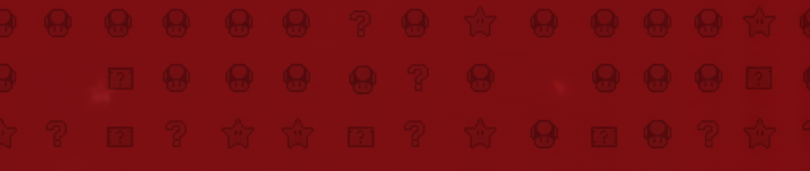
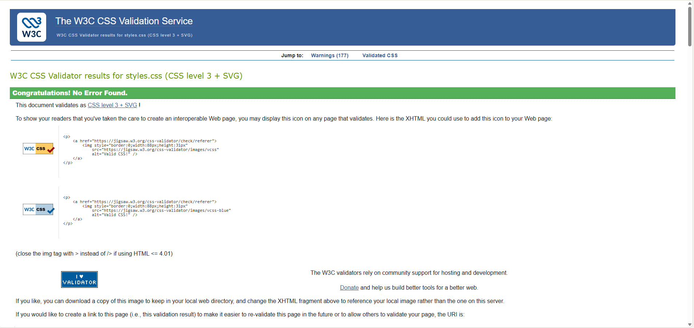

# NintendoManía - Portal de Análisis de Sagas Nintendo

## Índice Detallado del Contenido

- [Presentación](#presentación)
- [Justificación de la Temática](#justificación-de-la-temática)
- [Estructura de archivos](#estructura-de-archivos)
- [Estructura del Proyecto](#estructura-del-proyecto)
- [Estructura HTML5 Semántica](#estructura-html5-semántica)
- [Ejemplo de Indentación y Comentarios HTML](#ejemplo-de-indentación-y-comentarios-html)
- [Evolución HTML : HTML 4.01 a HTML5](#evolución-html-html401-a-html5)
- [Análisis de Estructura por Página](#análisis-de-estructura-por-página)
- [Uniformidad y Diferenciación](#uniformidad-y-diferenciación)
- [Buenas Prácticas Aplicadas](#buenas-prácticas-aplicadas)
- [Atributos HTML5 y Validación de Formularios](#atributos-html5-y-validación-de-formularios)
- [Estructura CSS y Diseño Visual](#estructura-css-y-diseño-visual)
- [Ventajas de usar CSS](#ventajas-de-usar-css)
- [Sistema de Diseño](#sistema-de-diseño)
- [Paleta de Colores](#paleta-de-colores)
- [Sistema Tipográfico](#sistema-tipográfico)
- [Arquitectura CSS](#arquitectura-css)
- [Metodología CSS: BEM](#metodología-css-bem)
- [Accesibilidad Visual](#accesibilidad-visual)
- [Diseño Responsive y Puntos de Ruptura](#diseño-responsive-y-puntos-de-ruptura)
- [Validación CSS Completa](#validación-css-completa)
- [Compatibilidad de Navegadores](#compatibilidad-de-navegadores)
- [Componentes CSS Documentados](#componentes-css-documentados)
- [Validación W3C](#validación-w3c)
- [Conclusión](#conclusión)

---

## Presentación

Somos **NintendoManía**, un grupo de profesionales independientes unidos por la pasión y el rigor histórico hacia las sagas principales de Nintendo. 

Nuestro objetivo es crear un **portal digital especializado** que documente:
- El **lore y cronología** de desarrollo
- Las **curiosidades y easter eggs**
- El **análisis profundo** de mecánicas y evolución

Las sagas cubiertas son: **Super Mario Bros**, **Splatoon** y **Kirby**.

De la misma forma, la temática friki se aborda con una **metodología de desarrollo profesional**, garantizando que el producto final cumpla con los estándares más altos de **accesibilidad, estructura web y validación W3C**.

---

## Justificación de la Temática

### Decisiones Clave y Rigor Técnico

La elección de **NintendoManía** fue estratégica. Buscábamos un proyecto sostenible que permitiera:
- Aplicar nuestros conocimientos técnicos al más alto nivel
- Abordar contenido de interés para la comunidad gaming
- Demostrar dominio de **HTML5 semántico puro**

### Ventajas Técnicas de Esta Temática

1. **Semántica Avanzada:** La estructura de sagas, personajes y armas es perfecta para usar `<section>`, `<article>`, `<figure>` y `<aside>`.

2. **Uso Moderno de HTML5:** Empleamos etiquetas como `<details>` y `<summary>` para interactividad sin JavaScript.

3. **Atributos de Accesibilidad:** Usamos `alt` descriptivos en **150+ imágenes**, garantizando que lectores de pantalla comprendan el contenido visual.

4. **Formulario Robusto:** El formulario de contacto incluye **7 tipos diferentes de inputs** (email, tel, url, select, radio, checkbox, textarea), validación HTML5 completa, y uso de `<fieldset>` y `<legend>` para accesibilidad.

5. **Representación de Datos:** 4 tablas semánticas en `comparativas.html` con `<caption>`, `<thead>`, `<tbody>` y `scope` attributes, cumpliendo requisitos de datos tabulares.

---

## Estructura de Archivos

```
proyecto-nintendomanía/
├── index.html
├── about.html
├── contacto.html
├── comparativas.html
├── styles.css
├── sagas/
│   ├── kirby.html
│   ├── mario.html
│   └── splatoon.html
├── assets/
│   ├── css/
│   └── imgs/
│       ├── [150+ imágenes]
├── README.md
```

---

## Estructura del Proyecto

El proyecto consta de **7 páginas HTML** (raíz + carpeta sagas), cada una con **estructura única y diferenciada**:

| Archivo | Temática Principal | Estructura Diferencial Clave | Contenido |
| :--- | :--- | :--- | :--- |
| **`index.html`** | Portada e introducción | **Índice Modular:** `<aside>` con `<details>` para navegación | Introducción sagas, 3 sagas destacadas, newsletter |
| **`about.html`** | Sobre nosotros, equipo, misión | **Semántica de Listas:** `<ul>` para pilares, `<ol>` para trayectoria cronológica | 4 secciones temáticas|
| **`contacto.html`** | Formulario y FAQ | **Formulario Avanzado:** `<fieldset>` por tema, `<details>` para FAQ | 7 campos, validación HTML5 completa |
| **`comparativas.html`** | Análisis comparativo de sagas | **Tabular Rigurosa:** 4 `<table>` semánticas con `scope` | Hitos, evolución por saga, análisis |
| **`sagas/splatoon.html`** | Cronología, armas, personajes, lore | **Lineal y Modular:** Cronología + Armas + Idols + Curiosidades | 6 secciones y uso de figuras descriptivas|
| **`sagas/mario.html`** | Evolución 2D → 3D, personajes icónicos | **Jerárquica de Hitos:** Artículos por era (2D vs 3D) | 800+ palabras , secciones diferentes y citas |
| **`sagas/kirby.html`** | Habilidades, jefes, lore cósmico | **Fichas de Lore:** Intensivo uso de `<figure>` + `<figcaption>` | Uso de figcaptions, 1000+ palabras |

---

## Estructura HTML5 Semántica

### Por Qué Estas Etiquetas Semánticas

Nuestro proyecto utiliza **HTML5 semántico** para garantizar:

- **Accesibilidad:** Lectores de pantalla comprenden claramente la estructura
- **SEO:** Motores de búsqueda identifican contenido importante  
- **Mantenibilidad:** Código autoexplicativo y fácil de actualizar
- **W3C Compliance:** Validación perfecta sin errores

### Etiquetas Semánticas Utilizadas

#### `<header>`
- **Propósito:** Contiene logo y navegación principal
- **Uso:** Presente en todas las páginas como sección superior
- **Beneficio:** Proporciona contexto de navegación coherente
- **Accesibilidad:** Lectores de pantalla identifican esta área como navegación

#### `<nav>`
- **Propósito:** Agrupa enlaces de navegación
- **Uso:** Menú principal en header; menús internos en sagas
- **Beneficio:** Navegación intuitiva entre páginas y secciones
- **Accesibilidad:** Navegadores identifican claramente la navegación

#### `<main>`
- **Propósito:** Contiene contenido único de cada página
- **Uso:** Centro de cada página (nunca se repite)
- **Beneficio:** Distingue contenido principal del secundario (header/footer)
- **Accesibilidad:** Lectores de pantalla saltan directamente al contenido importante

#### `<section>`
- **Propósito:** Agrupa contenido temático relacionado
- **Uso:** Cronología, Armas, Personajes, Curiosidades en sagas
- **Beneficio:** Estructura jerárquica clara y lógica
- **Accesibilidad:** Permite navegación por secciones temáticas

#### `<article>`
- **Propósito:** Contenido independiente y reutilizable
- **Uso:** Cada juego en cronología, cada arma, cada personaje, cada miembro del equipo
- **Beneficio:** Componentes autónomos que podrían existir fuera del contexto original
- **Accesibilidad:** Cada artículo es una unidad semántica completa

#### `<aside>`
- **Propósito:** Contenido secundario/complementario
- **Uso:** Imágenes destacadas, curiosidades, información lateral, formularios complementarios
- **Beneficio:** Diferencia contenido complementario del flujo principal
- **Accesibilidad:** Identifica claramente información tangencial

#### `<figure>` + `<figcaption>`
- **Propósito:** Imagen + descripción semánticamente vinculadas
- **Uso:** **145+ imágenes** en todo el proyecto
- **Beneficio:** Contexto visual con descripción clara
- **Accesibilidad:** Lectores de pantalla pueden entender imágenes

#### `<details>` + `<summary>`
- **Propósito:** Contenido expandible/contraíble
- **Uso:** FAQ en contacto.html, destacados en index.html
- **Beneficio:** Interactividad nativa sin JavaScript
- **Accesibilidad:** Completamente funcional con teclado y lectores

#### `<table>`, `<thead>`, `<tbody>`, `<caption>`
- **Propósito:** Datos tabulares semánticamente estructurados
- **Uso:** 4 tablas en comparativas.html
- **Beneficio:** Datos claramente organizados y comparables
- **Accesibilidad:** `scope` attributes permiten lectura correcta por lectores de pantalla

#### `<label>`, `<fieldset>`, `<legend>`
- **Propósito:** Formularios accesibles y bien estructurados
- **Uso:** contacto.html con 7 campos variados
- **Beneficio:** Asociación clara entre etiquetas e inputs
- **Accesibilidad:** Navegación por teclado y lectores de pantalla

#### `<footer>`
- **Propósito:** Información del sitio, links secundarios, copyright
- **Uso:** Presente en todas las páginas
- **Beneficio:** Refuerza coherencia estructural del sitio
- **Accesibilidad:** Ubicación consistente de información secundaria

---

## Ejemplo de Indentación y Comentarios HTML

Asimismo, para cumplir estrictamente con las buenas prácticas del criterio **2.b**, se incluye un ejemplo real de estructura HTML del proyecto, mostrando **indentación consistente (2 espacios)** y **comentarios útiles** que documentan las secciones principales de la página.

```html
<!-- HEADER: Navegación principal del sitio -->
<header class="cabecera">
  <!-- Menú de navegación principal con enlaces a las secciones clave -->
  <nav class="cabecera__menu" aria-label="Navegación principal">
    <ul class="cabecera__menu--lista">
      <li><a href="index.html" class="cabecera__menu--enlace">Inicio</a></li>
      <li><a href="about.html" class="cabecera__menu--enlace">Sobre nosotros</a></li>
      <li><a href="comparativas.html" class="cabecera__menu--enlace">Comparativas</a></li>
      <li><a href="contacto.html" class="cabecera__menu--enlace">Contacto</a></li>
    </ul>
  </nav>
</header>

<!-- MAIN: Contenido principal único de la página de inicio -->
<main id="main">
  <!-- Sección introductoria con héroe visual de NintendoManía -->
  <section class="introduccion">
    <h1>NintendoManía</h1>
    <p>Portal profesional de análisis de sagas de Nintendo.</p>
    <figure class="introduccion__figura">
      
      <figcaption>Universo Nintendo en un solo lugar.</figcaption>
    </figure>
  </section>

  <!-- Sección con las tres sagas principales destacadas -->
  <section class="sagas-principales">
    <article class="sagas-principales__mario">
      <h2>Super Mario Bros</h2>
      <p>Análisis de la evolución de Mario del 2D al 3D.</p>
    </article>

    <article class="sagas-principales__splatoon">
      <h2>Splatoon</h2>
      <p>Estudio de armas, modos competitivos y lore del Inkopolis.</p>
    </article>

    <article class="sagas-principales__kirby">
      <h2>Kirby</h2>
      <p>Recorrido por las habilidades de copia y el lore cósmico.</p>
    </article>
  </section>

  <!-- Sección de newsletter para suscripción al portal -->
  <section class="newsletter">
    <h2>Suscríbete a NintendoManía</h2>
    <form class="newsletter__formulario" action="#" method="post">
      <label for="email_newsletter">Correo electrónico</label>
      <input 
        type="email" 
        name="email_newsletter" 
        id="email_newsletter" 
        class="newsletter__formulario--input"
        placeholder="tu@email.com"
        required
      >
      <p id="email-newsletter-ayuda" class="newsletter__ayuda">
        Usaremos tu correo solo para enviarte novedades sobre el portal.
      </p>
      <button type="submit" class="newsletter__boton">Suscribirme</button>
    </form>
  </section>
</main>

<!-- ASIDE: Contenido complementario (noticias y destacados) -->
<aside class="extra">
  <section class="noticias-destacadas">
    <h2>Noticias destacadas</h2>
    <!-- Cada entrada podría ampliarse en el futuro a un <article> independiente -->
    <p>Splatoon 3 recibe nuevo mapa competitivo.</p>
  </section>

  <section class="puntos-destacados">
    <h2>Lo mejor de cada saga</h2>
    <details class="puntos-destacados__mario">
      <summary class="puntos-destacados__mario--sumario">Mario</summary>
      <p>Selección de los hitos más importantes de la saga en 2D y 3D.</p>
    </details>
  </section>
</aside>

<!-- FOOTER: Información secundaria del sitio -->
<footer class="pie-pagina">
  <p>&copy; 2024 NintendoManía Team. Proyecto académico con fines educativos.</p>
</footer>
```

En este ejemplo se demuestra de forma explícita:

- **Indentación consistente** de 2 espacios en toda la estructura.
- **Comentarios útiles** al inicio de cada bloque estructural (`HEADER`, `MAIN`, `ASIDE`, `FOOTER`).
- **Organización jerárquica lógica**: `header` → `main` → `aside` → `footer`.
- **Uso impecable de etiquetas semánticas** para cada tipo de contenido.

---

## Evolución HTML: HTML4.01 a HTML5

### DOCTYPE
- **HTML4.01**: `<!DOCTYPE html PUBLIC ...>` (largo, complejo)
- **HTML5**: `<!DOCTYPE html>` (simple, universal)
- **Estado**: Por esa razón hemos usado HTML5

### Elementos Semánticos
| Estructura | HTML4 | HTML5 | Estado |
|-----------|-------|-------|--------|
| Navegación | `<div class="nav">` | `<nav>` | Usado |
| Encabezado | `<div class="header">` | `<header>` | Usado |
| Artículo | `<div class="article">` | `<article>` | Usado |
| Lateral | `<div class="sidebar">` | `<aside>` | Usado |
| Principal | `<div id="main">` | `<main>` | Usado |

### Tipos de Input (HTML5)
- `<input type="email">` (validación nativa)
- `<input type="tel">` (teclado teléfono en mobile)
- `<input type="url">` (validación URL)
- `<input type="date">` (calendario)
- **Antes (HTML4)**: Solo `<input type="text">` + validación JavaScript

### Elementos Obsoletos EVITADOS
| Elemento | Razón | Alternativa |
|----------|-------|-------------|
| `<font>` | Mezcla contenido + estilo | CSS + `<span>` |
| `<center>` | Obsoleto en HTML5 | CSS `text-align: center` |
| `<u>` | Confunde con enlaces | CSS `text-decoration` |
| `<b>` sin semántica | Desaconsejado | `<strong>` o CSS |

---

## Análisis de Estructura por Página

### index.html - Página de Inicio

**Propósito:** Portal principal del sitio - acceso rápido a todas las sagas

**Estructura:**
```html
<header>
  <nav>Menú de navegación principal</nav>
</header>

<main>
  <section>Introducción + imagen principal</section>
  <section>Sagas destacadas (3 × <article>)</section>
  <section>Newsletter (suscripción)</section>
</main>

<aside>
  Noticias destacadas
  Puntos destacados por saga (<details>)
</aside>

<footer>Información del sitio</footer>
```

**Decisiones de estructura:**
- `<section>` para bloques temáticos claros
- `<article>` para cada saga (independientes)
- `<aside>` para contenido complementario
- `<details>` + `<summary>` para interactividad sin JS

---

### about.html - Sobre Nosotros

**Propósito:** Información del equipo, misión y trayectoria

**Estructura:**
```html
<header><nav/></header>

<main>
  <section>Sobre nosotros + historia</section>
  <section>Pilares del proyecto (<ul>)</section>
  <section>Equipo (3 × <article> con figuras)</section>
  <section>Trayectoria (<ol> cronológica)</section>
</main>

<aside>Llamada para contribuyentes</aside>
<footer/>
```

**Decisiones de estructura:**
- `<article>` para cada miembro del equipo (independientes)
- `<ul>` para pilares (contenido no ordenado)
- `<ol>` para trayectoria (cronología = contenido ordenado)
- `<aside>` para información complementaria

---

### contacto.html - Formulario y Contacto

**Propósito:** Permitir contacto directo y resolver FAQ

**Estructura:**
```html
<header><nav/></header>

<main>
  <section>Introducción</section>
  <section>Formulario
    <fieldset>Datos personales</fieldset>
    <fieldset>Detalles de la petición</fieldset>
    <fieldset>Información adicional</fieldset>
  </section>
  <section>FAQ (<details> expandibles)</section>
</main>

<footer/>
```

**Decisiones de estructura:**
- `<fieldset>` para agrupar inputs por tema
- `<legend>` para etiquetas de grupo
- `<label>` para cada input (accesibilidad)
- `<details>` + `<summary>` para FAQ (sin JS)
- **7 tipos de inputs:** text, email, tel, url, select, radio, textarea
- **Validación HTML5:** required, type validation, minlength

---

### comparativas.html - Comparativa de Sagas

**Propósito:** Análisis comparativo de Mario, Splatoon y Kirby

**Estructura:**
```html
<header><nav/></header>

<main>
  <section>Introducción</section>
  <section>Hitos (<table>)</section>
  <section>Evolución Splatoon (<table>)</section>
  <section>Evolución Mario (<table>)</section>
  <section>Evolución Kirby (<table>)</section>
  <section>Análisis (3 × <article>)</section>
</main>

<aside>Formulario de votación</aside>
<footer/>
```

**Decisiones de estructura:**
- `<table>` con `<caption>`, `<thead>`, `<tbody>`
- `<th>` con `scope="col"` y `scope="row"`
- `<article>` para análisis individual de cada saga
- `<aside>` con formulario de votación

---

### sagas/splatoon.html - Análisis de Saga Splatoon

**Propósito:** Análisis profundo: cronología, armas, personajes, curiosidades

**Estructura:**
```html
<header><nav>Menú + navegación interna</nav></header>

<main>
  <section>Introducción (h1 + figura + descripción)</section>
  
  <section id="timeline">Desarrollo de la saga
    6 × <article>(juegos cronológicos)</article>
  </section>
  
  <section id="cronologia">Cronología detallada
    6 × <article>(con h3, p, <ul>, figcaption)</article>
  </section>
  
  <section id="armas">Tipos de Armas
    4 × <article>(categorías)
      Múltiples <figure> con armas
  </section>
  
  <section id="idols">Las Idols
    3 × <article>(grupos de música)</article>
  </section>
  
  <section id="curiosidades">Easter Eggs
    3 × <article>(curiosidades)</article>
  </section>
</main>

<aside id="imagenes-destacadas">
  4 imágenes destacadas del universo Splatoon
</aside>

<footer/>
```
---

### sagas/mario.html - Análisis de Saga Mario

**Propósito:** Historia, evolución 2D→3D, personajes icónicos

**Estructura:**
```html
<header><nav/></header>

<main>
  <section>Introducción</section>
  
  <section id="hitos-2d">Hitos 2D
    3-4 × <article>(Mario Bros, SMB, etc.)</article>
  </section>
  
  <section id="hitos-3d">Hitos 3D
    3-4 × <article>(Super Mario 64, Galaxy, Odyssey)</article>
  </section>
  
  <section id="personajes">Personajes Icónicos
    Múltiples <article> con figuras
  </section>
  
  <section id="curiosidades">Curiosidades
    <article> con análisis de lore
  </section>
</main>

<aside>
  Imágenes y hechos destacados
</aside>

<footer/>
```

---

### sagas/kirby.html - Análisis de Saga Kirby

**Propósito:** Cronología, habilidades, jefes, lore cósmico

**Estructura:**
```html
<header><nav/></header>

<main>
  <section>Introducción</section>
  
  <section id="cronologia">Cronología
    9 × <article>(juegos)</article>
  </section>
  
  <section id="habilidades">Habilidades (Copy Abilities)
    5 × <article> con figura de cada habilidad
  </section>
  
  <section id="jefes">Jefes Recurrentes
    3 × <article> con figuras
  </section>
  
  <section id="curiosidades">Curiosidades y Lore
    3 × <article>
  </section>
</main>

<aside id="galeria">Imágenes destacadas</aside>
<aside id="extras">Información adicional</aside>

<footer/>
```

---

## Uniformidad y Diferenciación

### Lo que todas las páginas comparten:
- Estructura `<header>` → `<main>` → `<footer>`
- Navegación coherente y accesible
- Metadatos completos
- Validación W3C sin errores
- Indentación consistente
- Comentarios en HTML explicando secciones

### Lo que las diferencia:
- Organización interna de `<section>`
- Uso específico de `<article>` según contenido
- Cantidad y tipo de tablas/listas
- Uso de `<aside>`
- Profundidad de análisis

---

## Buenas Prácticas Aplicadas

### 1. Semántica HTML5
- Uso correcto de `<header>`, `<main>`, `<footer>`
- `<section>` para agrupar contenido temático
- `<article>` para contenido independiente
- `<aside>` para contenido complementario
- `<figure>` + `<figcaption>` para imágenes con contexto
- `<table>` + `<caption>` + `<thead>` + `<tbody>` para una tabla de datos

### 2. Accesibilidad
- **150+ imágenes** con `alt` descriptivo
- `width` y `height` especificados en todas las imágenes
- `<label>` asociadas correctamente a inputs de forma implícita (sin necesidad de uso de id)
- `<fieldset>` + `<legend>` en formulario
- `scope` attributes en tablas
- Navegación por IDs para enlaces internos

### 3. Indentación y Legibilidad
- Indentación consistente (2 espacios)
- Código organizado jerárquicamente
- Relaciones padre-hijo claras
- Comentarios explicativos en bloques principales

### 4. Validación
- HTML5 válido según W3C Markup Validator
- Sin errores de cierre o anidación
- Metadatos completos en `<head>`

### 5. Metadatos Completos
- `<meta charset="UTF-8">`
- `<meta name="viewport" content="width=device-width, initial-scale=1.0">`
- `<meta name="description" content="...">`
- `<meta name="author" content="NintendoManía Team">`
- Open Graph tags (og:title, og:description, og:image)

### 6. Formularios Robustos
- 7 tipos de inputs: text, email, tel, url, select, radio, textarea
- Validación HTML5: `required`, `type`, `minlength`, `pattern`
- Campos obligatorios vs opcionales claramente diferenciados
- Botones con funciones específicas: `submit`, `reset`

### 7. Contenido Original
- Sin Lorem Ipsum genérico
- **1000+ palabras** de análisis por saga
- Información verificada y profesional
- Estructurado de forma comprensible

---

## Atributos HTML5 y Validación de Formularios

Asimismo, para cubrir el criterio **2.c** , hemos documentado de forma explícita la selección de etiquetas, atributos y la validación aplicada en los formularios y contenido.

### Tipos de Input y Atributos Utilizados

| Input Type | Atributos utilizados | Página | Finalidad | Validación |
|-----------|----------------------|--------|-----------|-----------|
| `text` | `name`, `id`, `required`, `minlength="3"`, `placeholder` | contacto.html | Nombre de usuario | Mínimo 3 caracteres, obligatorio. |
| `email` | `name`, `id`, `type="email"`, `required`, `placeholder` | contacto.html, index.html (newsletter) | Correo electrónico | Validación nativa de formato email + campo obligatorio. |
| `tel` | `name`, `id`, `type="tel"`, `pattern="[0-9]{9}"`, `placeholder` | contacto.html | Teléfono de contacto | Debe tener exactamente 9 dígitos numéricos. |
| `url` | `name`, `id`, `type="url"`, `required`, `placeholder` | contacto.html | URL de portfolio / web personal | Validación nativa para formato de URL. |
| `radio` | `name`, `id`, `value`, `required` | contacto.html | Selección de tema o motivo de contacto | Obliga a escoger exactamente una opción. |
| `checkbox` | `name`, `id`, `value` | contacto.html, index.html | Aceptación de condiciones / suscripciones | Permite múltiples selecciones, gestionado por nombre del campo. |
| `select` | `name`, `id`, `required` | contacto.html | Selección de categoría o asunto | Obliga a seleccionar una opción válida. |
| `textarea` | `name`, `id`, `required`, `minlength="10"`, `maxlength="500"`, `rows` | contacto.html | Mensaje detallado del usuario | Entre 10 y 500 caracteres. |

---

## Estructura CSS y Diseño Visual

Para llevar a cabo el proyecto hemos incluido toda la parte de diseño y estilos en una **única hoja de estilos global (`styles.css`)** organizada en bloques numerados y comentados, que agrupan los estilos por **funcionalidad y por página**. Esta organización garantiza coherencia visual en todo el portal y facilita el mantenimiento.

### 1. Arquitectura del fichero CSS

Hemos estructurado la hoja de estilos de forma modular mediante comentarios numerados:

1. **Reset básico**
2. **Variables globales**
3. **Estilos generales**
4. **Cabecera genérica**
5. **Pie de página**
6. **Página inicio (`index.html`)**
7. **Página contacto (`contacto.html`)**
8. **Página sobre nosotros (`about.html`)**
9. **Página comparativas (`comparativas.html`)**
10. **Página Splatoon (`sagas/splatoon.html`)**
11. **Página Mario (`sagas/mario.html`)**
12. **Página Kirby (`sagas/kirby.html`)**

Hemos considerado utilizar este sistema puesto que permite localizar rápidamente cualquier bloque de estilos y evita mezclar reglas de distintas páginas en un mismo bloque conceptual.

---

## Sistema de Diseño

### Paleta de Colores

En el proyecto hemos implementado un sistema de colores estratégico con variables CSS que garantizan consistencia y facilitan el mantenimiento:

| Color | Hex | Variable CSS | Uso Principal |
|-------|-----|--------------|---------------|
| **Primario** | #800E13 | `--color-principal` | Bordes, botones CTA (click to action), títulos destacados, componentes interactivos |
| **Secundario** | #48a1ee | `--color-secundario` | Fondos, acentos, hover effects, botones secundarios |
| **Blanco** | #ffffff | `--color-blanco` | Texto sobre fondos oscuros, contenedores principales |
| **Negro** | #000000 | `--color-negro` | Texto principal, bordes, iconografía |
| **Mario (Rojo)** | #E52521 | `--color-principal__mario` | Identidad visual saga Mario, fondos temáticos |
| **Splatoon (Magenta)** | #F02D7D | `--color-principal__splatoon` | Identidad visual saga Splatoon, fondos temáticos |
| **Kirby (Rosa)** | #ffb6e6 | `--color-principal__kirby` | Identidad visual saga Kirby, fondos temáticos |


### Fondos por Contexto

De la misma forma, los fondos temáticos se adaptan según la página y las preferencias del usuario:

- `--color-fondo`: #c5e3f5 (azul claro) → fondo general
- `--color-fondo-splatoon`: #eed3f4 (púrpura claro)
- `--color-fondo-mario`: #f0a4a4 (rojo suave)
- `--color-fondo-kirby`: #ddfbf1 (verde menta claro)

En **modo oscuro** (`@media (prefers-color-scheme: dark)`):
- `--color-fondo`: #050816de (azul marino oscuro)
- `--color-fondo-splatoon`: #21152a (púrpura oscuro)
- `--color-fondo-mario`: #103b3b (verde azulado oscuro)
- `--color-fondo-kirby`: #1f1f23 (gris oscuro)


---

# Ventajas de usar CSS

El proyecto NintendoManía se ha desarrollado siguiendo de forma estricta el principio de **separación de responsabilidades**:

- **Fase 1:** solo HTML5 semántico (sin estilos ni inline, ni internos, ni externos).
- **Fase 2:** un **único archivo externo `styles.css`** que concentra todo el diseño y la presentación.

Esta decisión no es solo estética, sino que demuestra de forma práctica las **ventajas reales** de utilizar hojas de estilo.


### 1. Separación total entre contenido (HTML) y presentación (CSS)

En lugar de mezclar contenido y estilos en el mismo archivo, el HTML se dedica exclusivamente a la **estructura semántica**, mientras que el CSS controla el **aspecto visual** desde un único punto centralizado.

**Sin CSS externo (mala práctica):**

```html
<button style="background-color:#800E13;color:#ffffff;padding:1.5rem;border-radius:2rem;border:4px solid #48a1ee;font-weight:600;cursor:pointer;">
  Suscribirme
</button>
```

**Con CSS externo (enfoque del proyecto):**

```html
<button class="newsletter__boton">Suscribirme</button>
```

```css
.newsletter__boton {
  background-color: var(--color-principal);
  color: var(--color-blanco);
  padding: 1.5rem;
  border-radius: 2rem;
  border: 4px solid var(--color-secundario);
  font-weight: 600;
  cursor: pointer;
}
```

**Ventajas que nos ha aportado:**

- HTML mucho más legible y mantenible.
- El significado del contenido no se mezcla con decisiones de diseño.
- Nos ha permitido cambiar el diseño completo del sitio **sin tocar ni una sola etiqueta HTML**.


### 2. Reutilización masiva mediante variables CSS

El uso de **variables CSS** convierte el diseño en un sistema configurable.

```css
:root {
  --color-principal: #800E13;
  --color-secundario: #48a1ee;
  --color-principal__mario: #E52521;
  --color-principal__splatoon: #F02D7D;
  --color-principal__kirby: #ffb6e6;

  --fuente-base: 'Montserrat', Arial, sans-serif;
  --fuente-secundaria: 'Press Start 2P', cursive;
}
```

**Ejemplo de cambio global real:**

- Cambiar el color corporativo del portal implica **modificar una sola línea**:

```css
:root {
  --color-principal: #b00020;
}
```

En lugar de editar decenas de reglas, todos los botones, bordes y títulos que usan `var(--color-principal)` se actualizan automáticamente. Esto demuestra:

- **Mantenibilidad:** cambios globales en segundos.
- **Reducción de errores:** no hay riesgo de dejar colores antiguos olvidados.
- **Escalabilidad:** nos facilita preparar un tema alternativo o un rediseño.


### 3. Consistencia visual gracias a BEM y componentes reutilizables

La aplicación sistemática de la metodología **BEM (Block–Element–Modifier)** en las clases CSS garantiza que:

- Cada bloque (ej. `.newsletter`, `.sagas-principales`, `.cabecera`) representa un componente claro.
- Sus elementos (`__`) y modificadores (`--`) siguen una nomenclatura coherente y predecible.
- El mismo componente se ve y se comporta **igual** en todas las páginas.

**Ejemplo: botones consistentes en todo el sitio**

```html
<button class="newsletter__boton">Suscribirme</button>
<button class="contacto__formulario--boton">Enviar mensaje</button>
```

```css
.newsletter__boton,
.contacto__formulario--boton {
  background-color: var(--color-principal);
  color: var(--color-blanco);
  padding: 1.5rem;
  border-radius: 2rem;
  border: 4px solid var(--color-secundario);
  font-weight: 600;
  cursor: pointer;
  transition: border-color 0.4s ease, transform 0.5s ease;
}
```

**Resultado:**

- Misma tipografía, mismos tamaños, mismo comportamiento en hover y focus.
- **Experiencia de usuario coherente** en todas las páginas.
- Cualquier mejora (por ejemplo aumentar el `border-radius`) se hace **una sola vez**.


### 4. Mantenibilidad y escalabilidad del diseño

Al centralizar estilos en `styles.css` y estructurarlos por secciones y páginas, el proyecto:

- Permite localizar rápidamente el bloque de estilos que afecta a un componente.
- Evita solapamientos y conflictos entre reglas de páginas distintas.
- Facilita añadir nuevas secciones o incluso nuevas páginas sin “romper” el diseño existente.

**Ejemplo: añadir una nueva saga**

Para añadir una cuarta saga:

1. Se crea una nueva card HTML siguiendo la convención BEM.
2. Se añade un bloque de estilos específico en la sección correspondiente del CSS (p. ej. “Página inicio” o “Páginas de sagas”).
3. Se reutilizan variables de color, tipografía y espaciados existentes.

No es necesario redefinir botones, formularios o tipografía: ya son **componentes globales**.


### 5. Mejora de rendimiento y eficiencia de carga

Sin hojas de estilo externas, cada página repetiría los mismos estilos, aumentando el tamaño total descargado.

Con `styles.css`:

- El navegador descarga el CSS **una sola vez** y lo cachea.
- Las siguientes páginas reutilizan la misma hoja de estilos desde caché.
- Se elimina la duplicación de estilos inline o `<style>` internos por página.

Esto se traduce en:

- **Menos peso total transferido**.
- **Tiempos de carga más rápidos**, especialmente en navegación interna.
- **Mejor puntuación de rendimiento**


### 6. Soporte avanzado de responsive design y dark mode

Sin CSS, sería imposible:

- Definir **puntos de ruptura** para adaptar el diseño a móviles, tablets y escritorio.
- Aplicar un **modo oscuro** basado en las preferencias del usuario.
- Respetar `prefers-reduced-motion` para usuarios que desactivan animaciones.

Con CSS:

```css
/* Responsive design */
@media (max-width: 800px) {
  .sagas-principales {
    flex-direction: column;
    width: 90%;
  }
}

/* Modo oscuro automático */
@media (prefers-color-scheme: dark) {
  :root {
    --color-fondo: #050816de;
    --color-texto: #f5f5f5;
  }
}

/* Respeto a usuarios con reducción de movimiento */
@media (prefers-reduced-motion: reduce) {
  * {
    animation-duration: 0.01ms !important;
    transition-duration: 0.01ms !important;
  }
}
```

**Ventajas claras:**

- El **mismo HTML** se adapta visualmente a cualquier dispositivo.
- El portal **respeta las preferencias del usuario** (tema oscuro, menos animaciones).
- La lógica de adaptación está en el CSS, no en el HTML.

---
## Sistema Tipográfico

Hemos seleccionado las siguientes fuentes:

| Fuente | Variable CSS | Uso | Justificación |
|--------|--------------|-----|---------------|
| **Montserrat** | `--fuente-base` | Párrafos, descripciones, contenido general | Fuente moderna, sans-serif, excelente legibilidad en pantalla, pesos múltiples (300-700) para jerarquía |
| **Press Start 2P** | `--fuente-secundaria` | Títulos, botones, elementos destacados, encabezados | Fuente pixelada retro, refuerza identidad gaming/Nintendo y tiene un impacto visual alto |

Las fuentes se importan desde **Google Fonts** al inicio de `styles.css`:
```css
@import url('https://fonts.googleapis.com/css2?family=Montserrat:wght@300;400;500;600;700&family=Press+Start+2P&display=swap');
```

---

## Arquitectura CSS

### Organización de Fichero

La estructura de `styles.css` sigue este orden:

```
styles.css
├── Importación de fuentes (Google Fonts)
├── 1. Reset básico
│   ├── Selector universal *
│   └── @media prefers-reduced-motion
├── 2. Variables globales (:root)
│   ├── Colores (principal, secundario, específicos de la saga)
│   ├── Fondos por contexto
│   ├── Tipografías
│   └── @media (prefers-color-scheme: dark)
├── 3. Estilos generales
│   ├── body, a, img.
│   └── Comportamientos base
├── 4. Cabecera (.cabecera)
│   ├── Layout flexbox
│   ├── Navegación responsive
│   ├── Buscador formulario
│   └── Menú hamburguesa (mobile)
├── 5. Pie de página (.pie-pagina)
│   ├── Contacto y enlaces
│   ├── Información empresa
│   ├── Botón flotante "Volver arriba"
│   └── Responsive adaptations
├── 6. Página inicio (index.html)
│   ├── .introduccion
│   ├── .mejores-sagas
│   ├── .sagas-principales
│   ├── .extra (puntos destacados + noticias)
│   ├── .newsletter (formulario)
│   └── @media queries (1200px, 800px, 500px)
├── 7. Página contacto (contacto.html)
│   ├── .colaboracion
│   ├── .contacto (formulario)
│   ├── .faq-contacto (expandibles)
│   └── @media queries
├── 8. Página about (about.html)
│   ├── .sobre-nosotros
│   ├── .pilares
│   ├── .calidad (equipo)
│   └── @media queries
├── 9. Página comparativas (comparativas.html)
│   ├── Estilos específicos para tablas
│   ├── Estilos de votación
│   └── @media queries
├── 10-12. Páginas de sagas (Splatoon, Mario, Kirby)
    ├── Estilos de cronología
    ├── Estilos de armas/habilidades
    ├── Tarjetas temáticas
    └── @media queries

```

### Especificidad CSS

**Estrategia de especificidad:**
- **Omisión de `!important`:** No usado en el CSS
- **Selectores optimizados:** Uso de clases (especificidad 0.1.0) y combinadores directos
- **Cascada respetada:** Orden de media queries de mayor a menor ancho
- **Selectores compuestos:** `.cabecera__menu--enlace` (especificidad 0.3.0) para evitar conflictos

---

## Metodología CSS: BEM

A lo largo del desarrollo del proyecto hemos utilizado **BEM (Block Element Modifier)** adaptado al contexto:

### Nomenclatura Aplicada

**Bloques principales:**
- `.cabecera` - Header del sitio
- `.pie-pagina` - Footer
- `.newsletter` - Sección de suscripción
- `.sagas-principales` - Tarjetas de sagas
- `.contacto` - Formulario de contacto
- `.faq-contacto` - Preguntas frecuentes
- `.puntos-destacados` - Módulo de destacados
- `.noticias-destacadas` - Módulo de noticias

**Ejemplos de elementos usados (con `__`):**
```css
.cabecera__menu
.cabecera__logo
.pie-pagina__contacto
.newsletter__formulario
.sagas-principales__mario
```

**Ejemplos de modificadores usados (con `--`):**
```css
.cabecera__menu--lista
.cabecera__menu--enlace
.sagas-principales__mario--imagen
.puntos-destacados__splatoon--sumario
```

**Ventajas de este enfoque:**
- Evita colisiones de estilos entre componentes
- Facilita la reutilización y extensión
- Código autodocumentado (BEM actúa como especificación y se documenta por sí solo)

---

## Accesibilidad Visual

Todos los elementos interactivos tienen estados de foco visibles:

```css
.cabecera__menu--enlace:hover { color: var(--color-secundario); }
.newsletter__boton:hover { 
    background-color: var(--color-secundario);
    transform: translateY(-6px);
}
.contacto__formulario--input:focus { 
    border-color: var(--color-secundario);
}
```

**Transformaciones aplicadas:**
- `translateY(-6px)`: Desplazamiento vertical.
- `scale(1.05)`: Aumento de tamaño para botones
- Cambio de color de fondo
- Cambio de color de borde


### Respetar Preferencias del Usuario

**Animaciones reducidas:**
```css
@media (prefers-reduced-motion: reduce) {
    * {
        animation-duration: 0.01ms !important;
        animation-iteration-count: 1 !important;
        transition-duration: 0.01ms !important;
    }
}
```

**Modo oscuro:**
```css
@media (prefers-color-scheme: dark) {
    :root {
        --color-fondo: #050816de;
        --color-texto: #f5f5f5;
        /* ... resto de variables */
    }
}
```

---

## Diseño Responsive y Puntos de Ruptura

El CSS se escribe para escritorio primero, luego se adapta hacia abajo mediante `@media (max-width)`.

| Breakpoint | Dispositivo | Adaptaciones Clave |
|------------|-------------|-------------------|
| **1400px** | Monitores muy grandes | Reducción de padding, ajuste de gap en flex|
| **1200px** | Desktop estándar | Cambio de 3 columnas para vista más compacta |
| **800px** | Transición tablet-mobile | Reajuste fundamental de columnas del contenido|
| **500px** | Mobile pequeño | Vista minimalista y mínima, botones adaptados |
| **400px** | Mobile xtra small | Ocultar elementos no críticos, fuentes mínimas |

--- 

## Validación CSS Completa

### W3C CSS Validator

**Estado:** Válido sin errores

- **Archivo:** `styles.css` (167 KB)
- **Resultado:** 0 errores, warnings insignificativos
- **Validador:** https://jigsaw.w3.org/css-validator/



### Especificidades Detectadas y Justificadas

- Uso de prefijos de vendor (`-webkit-`) , prácticamente es compatible con todos los navegadores antiguos.
- Variables CSS
- Media queries bien estructuradas
- Sin `!important`

---

## Compatibilidad de Navegadores

### Desktop

| Navegador | Versión | Estado | Notas de Compatibilidad |
|-----------|---------|--------|------------------------|
| **Chrome** | 120+ | ✓ Totalmente compatible | CSS Grid, Flexbox, Variables CSS, Media Queries |
| **Firefox** | 121+ | ✓ Totalmente compatible | Soporte completo de todas las características |
| **Safari** | 17+ | ✓ Compatible | Requiere `-webkit-` para algunos efectos transform |
| **Edge** | 120+ | ✓ Totalmente compatible | Basado en Chromium, soporte idéntico a Chrome |

### Mobile

| Navegador | Versión | Estado | Notas de Compatibilidad |
|-----------|---------|--------|------------------------|
| **Chrome Mobile** | 120+ | ✓ | Soporte completo de responsive, touch-friendly |
| **Safari iOS** | 17+ | ✓ | Requiere `-webkit-`, viewport correcto |
| **Samsung Internet** | 20+ | ✓ | Basado en Chromium, compatible |
| **Android Browser** | 9+ | ✓ | Soporte de Media Queries, Flexbox |

---

## Componentes CSS Documentados

### Botones

**Selector base:** `.newsletter__boton`, `.contacto__formulario--boton`

```css
.newsletter__boton {
    background-color: var(--color-principal);
    border: 4px solid var(--color-secundario);
    padding: 1.5rem;
    border-radius: 2rem;
    color: white;
    font-weight: 600;
    transition: border-color 0.4s ease, transform 0.5s ease;
    cursor: pointer;
}

.newsletter__boton:hover {
    background-color: var(--color-secundario);
    color: var(--color-negro);
    border: 4px solid var(--color-principal);
    transform: translateY(-6px);
}

.newsletter__boton:active {
    transform: translateY(-3px);
}
```

**Estados:**
- Normal: Color principal con borde secundario
- Hover: Colores invertidos que aporta contraste y elevación vertical
- Active: Elevación menor
- Focus: Borde primario visible

### Tarjetas de Sagas

**Selector base:** `.sagas-principales__mario`, `.sagas-principales__splatoon`, `.sagas-principales__kirby`

```css
.sagas-principales__mario {
    padding: 2rem;
    background: var(--color-secundario);
    border-radius: 6rem;
    border: 5px solid var(--color-principal);
    transition: transform 0.5s ease;
}

.sagas-principales__mario:hover {
    transform: translateY(-6px);
}

.sagas-principales__mario--imagen {
    width: 300px;
    height: 300px;
    object-fit: cover;
    border-radius: 4rem;
    border: 3px solid var(--color-negro);
    box-shadow: 0 12px 25px rgba(0, 0, 0, 0.25);
    transition: transform 0.35s;
}

.sagas-principales__mario--imagen:hover {
    transform: scale(1) rotate(-3deg);
}
```

**Variantes:**
- `.sagas-principales__mario` - Tema rojo Mario
- `.sagas-principales__splatoon` - Tema magenta Splatoon
- `.sagas-principales__kirby` - Tema rosa Kirby

### Formularios

**Selector base:** `.newsletter__formulario`, `.contacto__formulario`

```css
.newsletter__formulario--input {
    padding: 1rem;
    border: 1.5px solid #BDBDBD;
    border-radius: 0.7rem;
    font-size: 1rem;
    background: var(--color-blanco);
    transition: border 0.18s;
}

.newsletter__formulario--input:focus {
    border: 3px solid var(--color-secundario);
    outline: none;
}

.contacto__formulario--input {
    width: 100%;
    padding: 0.5rem;
    border: 3px solid #b3c5f6;
    border-radius: 1rem;
    transition: border-color 0.75s ease;
}

.contacto__formulario--input:focus {
    border-color: var(--color-secundario);
}
```

**Características:**
- Transiciones suaves en focus
- Bordes coloreados que aportan contraste
- Accesible sin JavaScript

### Contenedores Expandibles (Details)

**Selector base:** `.puntos-destacados__mario--sumario`, `.faq-contacto__sumario`

```css
.faq-contacto__sumario {
    display: inline-block;
    color: white;
    background: var(--color-principal);
    font-family: var(--fuente-secundaria);
    padding: 1rem;
    border: 4px solid var(--color-secundario);
    border-radius: 2rem;
    cursor: pointer;
    transition: background-color 0.5s ease, transform 0.5s ease;
}

.faq-contacto__sumario:hover {
    background-color: var(--color-secundario);
    color: var(--color-negro);
    transform: translateY(-6px);
}

.faq-contacto__sumario--descripcion {
    font-size: 1rem;
    padding: 1rem;
    background-color: var(--color-sumario);
    border-left: 4px solid var(--color-principal);
    border-radius: 0.6rem;
}
```

**Ventajas:**
- Interactividad nativa HTML sin JavaScript
- Accesible completamente
- Estados claros (cuando están contraídos o extendidos)

---

## Validación W3C

Todas las páginas han sido validadas sin errores a través de [W3C HTLM Validator](https://validator.w3.org/#validate_by_upload):

| Página | Estado | Validador |
|--------|--------|-----------|
| **index.html** | Válido |  |
| **about.html** | Válido |  |
| **contacto.html** | Válido |  |
| **comparativas.html** | Válido |  |
| **sagas/splatoon.html** | Válido |  |
| **sagas/mario.html** | Válido |  |
| **sagas/kirby.html** | Válido |  |

Cabe destacar que lo único que se muestra en el W3C Validator son mensajes informativos respecto al uso de slash de cierre en las etiquetas autocontenidas y un warning en la sección `footer-extra` ya que ésta no posee un título propio puesto que esta sección es utilizada para el botón con posición `fixed` que nos facilita volver al inicio de la página.


**Validación de CSS** (Fase 2):
- styles.css | Válido | [W3C CSS Validator](https://jigsaw.w3.org/css-validator/)


---
## Conclusión

Finalmente, podemos afirmar que a través del proyecto de **NintendoManía** se ha demostrado un dominio avanzado de **HTML5**, **CSS3**, accesibilidad y herramientas de desarrollo web:

- Estructura HTML5 semántica, con uso preciso de `<header>`, `<main>`, `<section>`, `<article>`, `<aside>`, `<figure>`, `<figcaption>`, `<details>`, `<summary>`, `<table>`, `<label>`, `<fieldset>` y `<legend>`.
- Justificación clara de la evolución de HTML4.01 a HTML5 aplicada a decisiones concretas del proyecto.
- Uso experto de atributos (`alt`, `title`, `aria-*`, etc.) y formularios robustos con validación HTML5.
- Separación estricta entre **contenido** (HTML) y **presentación** (CSS), con una única hoja de estilos externa estructurada.
- Aplicación coherente de **BEM**, variables CSS, diseño responsive, dark mode y preferencias de usuario (`prefers-reduced-motion`, `prefers-color-scheme`).
- Validación completa con herramientas oficiales W3C para HTML y CSS.
- Uso de Git, VS Code y herramientas de navegador, con un flujo de trabajo basado en commits frecuentes y descriptivos.

